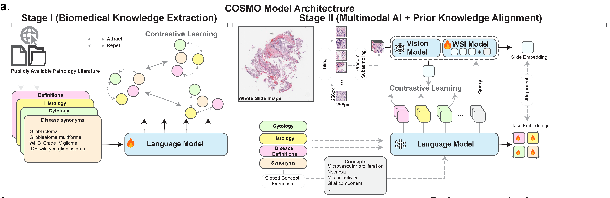

## Biomedical Knowledge-Enhanced Multimodal Learning for Common and Rare Cancer Pathology Diagnosis - A Multi-Center Validation Study

**Abstract**: _Cancer diagnosis relies on histopathological evaluation to determine appropriate treatment strategies, however accurate subtyping remains challenging for rare malignancies and morphologically similar subtypes. While vision-language foundation models show promise for computational pathology, existing approaches lack domain-specific biomedical knowledge and struggle with rare cancer subtypes due to limited training examples. To address this, we introduce COSMO, a knowledge-enhanced framework that integrates expert knowledge from pathology literature and biomedical ontologies to improve cancer subtyping across both common and rare malignancies. We curate domain expertise to construct a specialized language model that semantically encodes morphological features and diagnostic concepts. We trained and validated COSMO using 7,062 samples from nine patient cohorts spanning three continents, covering brain, lung, and kidney cancers with diverse histological subtypes. COSMO achieves balanced accuracies of 80.5% for common cancers and 66.2% for rare cancers, including subtypes with incidence rates as low as 0.22 per 100,000 person-years, outperforming standard pathology foundation models by up to 11.5%. The framework extracts interpretable pathology concepts aligned with WHO diagnostic criteria and features a modular architecture enabling integration with existing foundation models, demonstrating strong generalizability and clinical potential._



---

## 📚 Table of Contents

- [🏗️ Installation](#️-installation)  
- [📁 Repository Structure](#-repository-structure)
- [🔄 Workflow](#-complete-workflow)
  - [Phase 1: Knowledge Curation](#phase-1-knowledge-curation)
  - [Phase 2: Language Model Training](#phase-2-language-model-training)
  - [Phase 3: Text Embedding Extraction](#phase-3-text-embedding-extraction)
  - [Phase 4: Multimodal Model Training](#phase-4-multimodal-model-training)
  - [Phase 5: Model Inference](#phase-5-model-inference)
- [🙏 Acknowledgments](#-acknowledgments)
- [📄 Citation](#-citation)

---

## 🏗️ Installation

### Prerequisites

- Python 3.8+
- PyTorch 2.0+
- CUDA 11.8+ (for GPU support)
- 16GB+ GPU memory (recommended)

### Environment Setup

```bash
# Create conda environment
conda create -n cosmo python=3.10
conda activate cosmo

# Install PyTorch
conda install pytorch torchvision torchaudio pytorch-cuda=11.8 -c pytorch -c nvidia

# Install additional dependencies
pip install transformers>=4.36.0
pip install peft>=0.4.0
pip install accelerate
pip install scikit-learn pandas numpy tqdm
pip install requests beautifulsoup4  # For knowledge extraction

# For development
pip install pytest black isort
```

### Optional: CONCH Model Setup

If you plan to use CONCH for text embeddings, install CONCH separately:

```bash
# Clone and install CONCH (for text embedding extraction)
git clone https://github.com/mahmoodlab/conch.git
cd conch
pip install -e .

# Download CONCH weights and save logit scale
python -c "
import torch
from models.conch.open_clip_custom import create_model_from_pretrained
model, _ = create_model_from_pretrained('conch_ViT-B-16', './conch_weights.bin')
torch.save({'logit_scale': model.logit_scale.data}, './pretrained/conch_logit_scale.pt')
print('CONCH logit scale saved to ./pretrained/conch_logit_scale.pt')
"
```

---

## 📁 Repository Structure

After installation, your COSMO repository should be organized as follows:

```
COSMO/
├── src/cosmo/                          # Main package
│   ├── __init__.py
│   ├── data/
│   │   ├── __init__.py
│   │   ├── knowledge/                  # Knowledge extraction modules
│   │   │   ├── __init__.py
│   │   │   ├── oncotree_extractor.py   # OncoTree API interface
│   │   │   ├── nci_extractor.py        # NCI Thesaurus integration
│   │   │   ├── umls_extractor.py       # UMLS concept mapping
│   │   │   ├── histcyto_extractor.py   # Pathology feature extraction
│   │   │   ├── csv_generator.py        # Training data generation
│   │   │   └── templates/              # Knowledge templates (JSON)
│   │   │       ├── brainKT_prompt_names_vlm.json
│   │   │       ├── lungKT_prompt_names_vlm.json
│   │   │       └── kidneyKT_prompt_names_vlm.json
│   │   └── dataloaders/                # Data loading utilities
│   │       ├── __init__.py
│   │       ├── pathkt_data.py          # PathKT knowledge dataloader
│   │       └── wsi_data.py             # WSI bag dataloader
│   ├── models/
│   │   ├── __init__.py
│   │   └── llm.py                      # COSMO multimodal models
│   └── utils/                          # Utility functions
│       ├── __init__.py
│       ├── data_utils.py               # Data processing utilities
│       ├── wsi_utils.py                # WSI-specific utilities  
│       ├── label_mappings.py           # Cancer type mappings
│       └── training_utils.py           # Training utilities
├── scripts/                            # Executable scripts
│   ├── extract_embeddings.py           # Text embedding extraction
│   ├── test_know.sh                    # Test knowledge pipeline
│   ├── test_wsibag.sh                  # Test WSI dataloader
│   └── test_inference.sh               # Test inference
├── train_llm.py                        # Language model training
├── test.py                             # Model inference
├── examples/                           # Example data and configs
│   └── data/                          # Generated knowledge data
├── data/                              # Your dataset
│   ├── wsi_features/                  # WSI feature files (.pt/.pth)
│   ├── csv/                           # Patient metadata CSV files
│   └── splits/                        # Train/val/test split files
├── pretrained/                        # Model artifacts
│   ├── concepts/                      # Pre-extracted concept embeddings (.npy)
│   │   ├── brain_closed_concepts.json # Concept definitions
│   │   ├── brainNIH_cosmo_concepts.npy
│   │   └── brainNIH_cosmo_class.npy
│   └── weights/                       # Trained model checkpoints
│       ├── cosmollm/                  # Language model checkpoints
│       └── cosmo/                     # Multimodal model checkpoints
├── results/                           # Inference outputs
├── checkpoints/                       # Training checkpoints

```

---

## 🔄 Workflow

### Phase 1: Knowledge Curation

Extract pathology knowledge from biomedical databases and literature to create training data for specialized language models.

#### 1.1 OncoTree Knowledge Extraction

OncoTree provides structured cancer type definitions from Memorial Sloan Kettering Cancer Center.

```bash
# Extract brain cancer knowledge
python ./src/cosmo/data/knowledge/oncotree_extractor.py \
    --tissue BRAIN --output ./examples/data/brain_KT_onco.json

# Extract lung cancer knowledge  
python ./src/cosmo/data/knowledge/oncotree_extractor.py \
    --tissue LUNG --output ./examples/data/lung_KT_onco.json

# Extract kidney cancer knowledge
python ./src/cosmo/data/knowledge/oncotree_extractor.py \
    --tissue KIDNEY --output ./examples/data/kidney_KT_onco.json
```

**Expected Output Format** (`brain_KT_onco.json`):
```json
{
  "glioblastoma": {
    "umls": "C0017636",
    "nci": "C3058",
    "tissue": "CNS/Brain",
    "parents": [
      "CNS/Brain",
      "Diffuse Glioma"
    ],
    "synonyms": [],
    "definitions": [],
    "histologic_features": "",
    "cytologic_features": ""
  },
}
```

**Code Reference**: [`src/cosmo/data/knowledge/oncotree_extractor.py`](src/cosmo/data/knowledge/oncotree_extractor.py)

#### 1.2 NCI Thesaurus Enrichment

Enrich OncoTree data with detailed terminology from the National Cancer Institute.

```bash
# Enrich with NCI terminology
python ./src/cosmo/data/knowledge/nci_extractor.py \
    --input ./examples/data/brain_KT_onco.json \
    --output ./examples/data/brain_KT_nci.json
```

**Enhanced Output** (`brain_KT_nci.json`):
```json
{
  "glioblastoma": {
    "umls": "C0017636",
    "nci": "C3058",
    "tissue": "CNS/Brain",
    "parents": [
      "CNS/Brain",
      "Diffuse Glioma"
    ],
    "synonyms": [
      "glioblastoma",
      "cns, glioblastoma (gbm)",
      "spongioblastoma multiforme",
      "gbm"
    ],
    "definitions": [
      "a fast-growing type of central nervous system tumor ...",
      "the most malignant astrocytic tumor (who grade 4). it is composed of poorly differentiated ..."
    ],
    "histologic_features": "",
    "cytologic_features": ""
  }
}
```

**Code Reference**: [`src/cosmo/data/knowledge/nci_extractor.py`](src/cosmo/data/knowledge/nci_extractor.py)

#### 1.3 UMLS Integration (Optional)

Integrate with Unified Medical Language System for comprehensive medical concept mapping.

```bash
# Set your UMLS API key (register at https://uts.nlm.nih.gov/uts/)
export UMLS_API_KEY="your-api-key-here"

# Enrich with UMLS concepts
python ./src/cosmo/data/knowledge/umls_extractor.py \
    --input ./examples/data/brain_KT_nci.json \
    --output ./examples/data/brain_KT_umls.json \
    --api-key $UMLS_API_KEY
```

**Code Reference**: [`src/cosmo/data/knowledge/umls_extractor.py`](src/cosmo/data/knowledge/umls_extractor.py)

#### 1.4 Histopathological Feature Extraction (Manual/Copyright-Protected)

**⚠️ Important Note**: Detailed histopathological descriptions are extracted from PathologyOutlines.com, which requires:

1. **Manual effort**: Time-consuming process requiring pathology expertise
2. **Copyright restrictions**: We cannot share actual files due to copyright protection
3. **Alternative approach**: Use OncoTree + NCI data as base knowledge

If you have access to pathology literature, run:
```bash
# OPTIONAL: Extract histopathological features (requires manual curation)
python ./src/cosmo/data/knowledge/histcyto_extractor.py \
    --input ./examples/data/brain_KT_umls.json \
    --output ./examples/data/brain_KT_hist.json \
    --delay 2.0  # Respectful scraping delay
```

**For demonstration purposes**, you can proceed without this step using synthesized data.

#### 1.5 Generate Training CSV Files

Convert structured knowledge into training format for language models.

```bash
# Generate CSV files for language model training
python ./src/cosmo/data/knowledge/csv_generator.py \
    --input ./examples/data/brain_KT_umls.json \
    --tissue brain \
    --output-dir ./examples/data/ \
    --csv-types train
```

**Expected Output Format** (`brainNIH_knowledge_train.csv`):
```csv
entity_name	entity_text
0_t001_main Glioblastoma
0_t001_syn	Glioblastoma multiforme 
0_t001_def	Grade IV astrocytic tumors with microvascular proliferation and necrosis.
1_t001_main	Meningiomas 
1_t001_syn	Meningothelial Meningiomas 
1_t001_def	WHO grade I tumors with characteristic whorled growth pattern.
```

**File Structure**:
- `entity_name`: Structured identifier (`{index}_class_t{id}_{type}`)
  - `index`: 0 - N
  - `t00{id}`: tissue/cancer type identifier (0,1,2, ... etc.)
  - `type`: main/syn/def (main definition, synonym, definition)
- `entity_text`: Pathology knowledge text for training

**Code Reference**: [`src/cosmo/data/knowledge/csv_generator.py`](src/cosmo/data/knowledge/csv_generator.py)

#### 1.6 Concept Definitions (Pre-provided)

**Closed Concept Vocabularies**: We provide pre-extracted concepts that group fine-grained pathological features into coarser cancer types. These concepts are derived from comprehensive analysis of pathology literature and expert knowledge curation.

**Concept Extraction Process** (as detailed in our paper):
1. **Fine-grained extraction**: Identify specific pathological features from literature
2. **Semantic grouping**: Cluster related concepts under broader cancer categories  
3. **Expert validation**: Review by pathology experts for clinical relevance
4. **Hierarchy construction**: Organize concepts from specific features to general types

**Pre-provided Files**:
- `./pretrained/concepts/brain_closed_concepts.json` - Brain cancer concept definitions
- `./src/cosmo/data/knowledge/templates/brainKT_prompt_names_vlm.json` - Cancer subtype name variants

**Example Structure** (`brain_closed_concepts.json`):
```json
{
  "Adult-type diffuse gliomas": [
        "microvascular proliferation",
        "nuclear atypia",
        "necrosis",
        "sarcomatous component",
        "brisk mitotic activity",

        ....
        ]
}
```

**Template Structure** (`brainKT_prompt_names_vlm.json`):
```json
{
  "Adult-type diffuse gliomas": [
    "cns tumor glioblastoma, idh wild type",
    "oligodendroglioma",
    "astrocytoma",
    "diffuse astrocytoma",
    "glioblastoma",
    ...
    ]
}
```

**Note**: These files are provided as part of the COSMO framework. Users can create custom concept definitions for new cancer types by following the methodology described in our paper.

---

### Phase 2: Language Model Training

Train specialized language models on pathology knowledge to create domain-specific text encoders. This phase supports multiple base models and can be adapted for different cancer types, using text from multiple tissues for broader domain coverage.

#### 2.1 Training Data Preparation

Use the knowledge CSV files generated in Phase 1 for language model training:

```bash
# Verify training data exists
ls ./examples/data/brainNIH_knowledge_train.csv
ls ./examples/data/lungNIH_knowledge_train.csv  
ls ./examples/data/kidneyNIH_knowledge_train.csv
```

#### 2.2 Base Model Selection

COSMO supports multiple pretrained language models as starting points:

**Recommended Base Models:**
- **BioBERT**: `dmis-lab/biobert-base-cased-v1.1` - Biomedical literature pretrained
- **ClinicalBERT**: `emilyalsentzer/Bio_ClinicalBERT` - Clinical notes pretrained  
- **PubMedBERT** (Default): `microsoft/BiomedNLP-PubMedBERT-base-uncased-abstract` - PubMed abstracts

#### 2.3 Parameter-Efficient Fine-Tuning (PEFT)

COSMO uses LoRA (Low-Rank Adaptation) for efficient fine-tuning, reducing memory requirements and training time in[`train_llm.py`](train_llm.py):

```bash
# Train COSMO language model with PubMedBERT base (see arguments for model hyperparams.)
# Use all available cancer text (brain, lung, kidney etc ...)
python train_llm.py \
    --model-name 'microsoft/BiomedNLP-PubMedBERT-base-uncased-abstract' \
    --data-dir "./examples/data" \
    --json-dir "./src/cosmo/data/knowledge/templates" \
    --output-dir "./checkpoints" \
    --tissues "brain lung kidney" \ 
    --epochs 100
```

**Generated Artifacts:**
```
./checkpoints/cosmollm/
├── adapter_config.json       # LoRA adapter configuration
├── adapter_model.safetensors # Trained LoRA weights
├── mlp_embed.pt              # Text embedding projection layer
├── tokenizer_config.json     # Tokenizer configuration
├── tokenizer.json            # Tokenizer vocab and settings
└── training_args.json        # Training hyperparameters
```

---

### Phase 3: Text Embedding Extraction

Extract concept and class embeddings from trained language models for use in multimodal training and inference. This phase bridges the knowledge-enhanced language models with the multimodal components.

#### 3.1 Extract Using COSMO Model

Extract embeddings using your trained COSMO language model [`example script`](scripts/test_txtembs.sh):

```bash
# Extract embeddings with trained COSMO model
python scripts/extract_embeddings.py \
    --dataset brain \
    --text-model cosmo \
    --prev-type brainNIH \
    --checkpoint ./checkpoints/cosmollm \
    --output-dir ./pretrained/concepts
```

**Expected Output:**
- `brainNIH_cosmo_concepts.npy` - Fine-grained pathological concept embeddings
- `brainNIH_cosmo_class.npy` - Cancer class name embeddings

**Code Reference**: [`scripts/extract_embeddings.py`](scripts/extract_embeddings.py)

### Phase 4: Multimodal Model Training

Train the COSMO multimodal model using WSI features and text embeddings. The model learns to align visual pathology features with textual concept knowledge. COSMO supports features extracted from various foundation models including [CHIEF](https://github.com/hms-dbmi/CHIEF), [UNI](https://github.com/mahmoodlab/UNI), [CONCH](https://github.com/mahmoodlab/CONCH), and [GIGAPATH](https://github.com/prov-gigapath/prov-gigapath).

#### 4.1 Data Preparation

Ensure your WSI features and metadata are organized: For whole-slide processing, use your favorite pipeline (e.g., [CLAM](https://github.com/mahmoodlab/CLAM), etc) with stain-normalization using $512 \times 512$ tiles. (See paper for more details)

```bash
# Verify WSI feature files exist
ls ./data/wsi_features/*.pt

# Check patient metadata CSV
head ./data/csv/patient_metadata.csv

# Verify split files for cross-validation
ls ./data/splits/split_*.csv
```

**Expected Patient Data Format** (`patient_metadata.csv`):
```csv
case_id,slide_id,primary_diagnosis,class_name,slide_path
TCGA-02-0001,TCGA-02-0001-01Z,Glioblastoma,Adult-type diffuse gliomas,/path/to/slide_features
TCGA-02-0002,TCGA-02-0002-01Z,Low-Grade Glioma NOS,Paediatric-type diffuse low-grade gliomas,/path/to/slide_features
TCGA-02-0003,TCGA-02-0003-01Z,Pituitary Adenoma,Tumours of the sellar region,/path/to/slide_features
```

**Required Fields:**
- `case_id`: Unique patient/case identifier
- `slide_id`: Corresponding WSI slide identifier (matches .pt/.pth filename)
- `class_name`: Remapped cancer subtype name
- `primary_diagnosis`: Original subtype name


#### 4.2 Multimodal Training

Train the multimodal COSMO model using [`train_mllm.py`](train_mllm.py):

```bash
# Train multimodal model
python train_mllm.py \
    --wsi-root ./data/wsi_features \
    --patient-csv ./data/csv/patient_metadata.csv \
    --split-csv ./data/splits \
    --concept-root ./pretrained/concepts \
    --prev-type brainNIH \
    --text-model cosmo \
    --output-dir ./checkpoints/cosmo \
    --epochs 50 \
    --lr 2e-5
```

**Code Reference**: [`scripts/test_train.py`](scripts/test_train.sh)

---

### Phase 5: Model Inference

Perform inference on test data using trained COSMO models for cancer subtype prediction (common, rare, or combined).

Run inference using [`test.py`](test.py):

```bash
# Inference with trained model
python test.py \
    --wsi-root ./data/wsi_features \
    --patient-csv ./data/csv/patient_metadata.csv \
    --split-csv ./data/splits \
    --checkpoint ./checkpoints/cosmo/model_best.pth \
    --concept-root ./pretrained/concepts \
    --prev-type brainNIH \
    --text-model cosmo \
    --output-dir ./results \
    --runs 5
```

**Test Script**: [`inference example`](scripts/test_inference.sh)
**More Examples**: see [`scripts folder`](scripts/).

---

## 🙏 Acknowledgments

**Open Source Projects:**
This work builds upon and was inspired by several excellent open-source projects [TaskResidual](https://github.com/geekyutao/TaskRes), [CONCH](https://github.com/mahmoodlab/CONCH), [KEP](https://github.com/MAGIC-AI4Med/KEP). We thank the authors and developers for their contribution.

---

## 📄 Citation

If you find this work useful, please consider citing our paper:

```bibtex
@article{chikontwe2025bio,
  title={Biomedical Knowledge-Enhanced Multimodal Learning for Common and Rare Cancer Pathology Diagnosis - A Multi-Center Validation Study},
  author={Chikontwe et al.},
  journal={[Journal Name]},
  volume={[Volume]},
  number={[Number]},
  pages={[Pages]},
  year={2025},
  publisher={[Publisher]},
  doi={[DOI]},
  url={[URL]}
}
```

## License and Terms of Use

ⓒ [Yu Lab](https://yulab.hms.harvard.edu). This model and associated code are released under the [CC-BY-NC-ND 4.0]((https://creativecommons.org/licenses/by-nc-nd/4.0/deed.en)) license and may only be used for non-commercial, academic research purposes with proper attribution.
